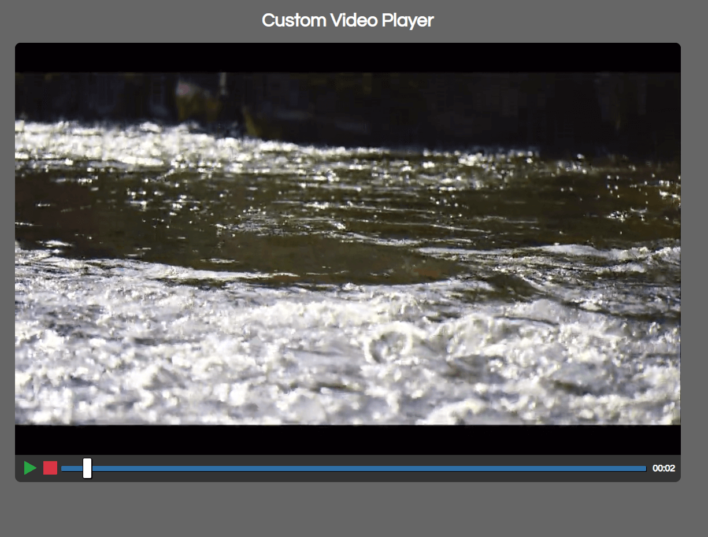

# Custom Video Player

> Custom video player using the HTML5 video element and it's JavaScript API with a custom design

### [[Demo](http://custom-video-player-ab.surge.sh)
[](https://radikal.ru/video/xzDDJbtLv8x)

### Get started

```shell script
git clone
```
```shell script
open index.html
```
or
```shell script
npm i -g live-server
```
```shell script
live-server
```
